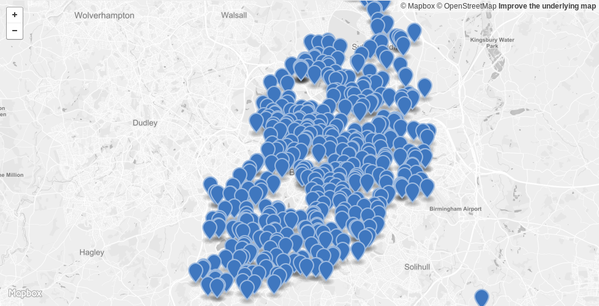

# Birmingham Schools Dataset

Data package for the list of schools in Birmingham, UK, extracted from
https://data.birmingham.gov.uk/dataset/birmingham-schools-datasets.

## Data

The data files consist of the CSV taken from Birmingham's Open Data Portal with
a few modifications:

* All headers are lowercased, so `WEB_SITE` becomes `web_site`
* The Kingsland school web site URL is fixed by adding a "http://" prefix

These modifications are done via the
[scripts/clean\_data.py](scripts/clean_data.py) script.

I also generated a GeoJSON file with the schools coordinates and their
attributes in the
[data/birmingham\_schools.geojson](data/birmingham_schools.geojson). The
coordinates come from the CSV's `_geom` column.

## Preparation

Updating the data requires:

* Python 3
* wget
* Make

Considering you have these pre-requisites, you can update the data by running `make update`. This will download the latest file version and clean it.

You can also test the data locally. This requires the Python package `tox`, that you can install using `pip install tox`. Then the tests can be run using `make test`.

## License

The data is licensed under the [UK Open Government License
v3.0](http://www.nationalarchives.gov.uk/doc/open-government-licence/version/3/).
Everything else is licensed under the [CC0 Public Domain
Waiver](https://creativecommons.org/publicdomain/zero/1.0/).
